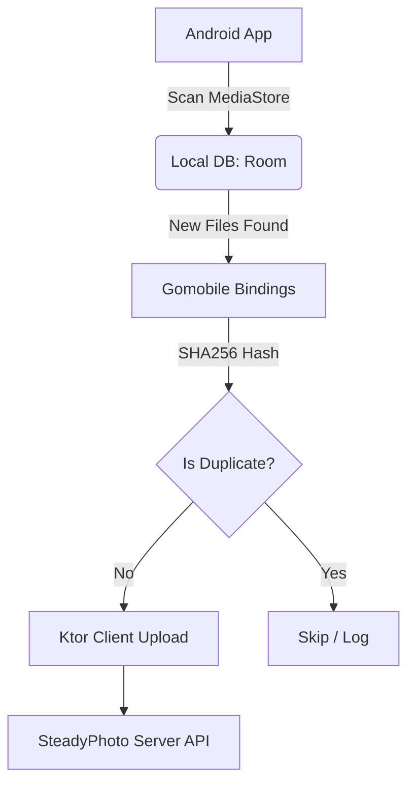

# SteadyPhoto Android Sync Client

## 1. Project Scope & Purpose

The primary goal of this Android application is **Automated Media Synchronization**. It acts as a secure bridge between the user's device storage and the central SteadyPhoto server.

**Core Functionality:**
1.  **Scan**: Periodically scan local device media (`DCIM`, `Pictures`) for new photos/videos.
2.  **Process**: Compute SHA256 hashes (deduplication) and extract EXIF metadata locally using Gomobile bindings.
3.  **Upload**: Batch upload unique files to the existing Go backend (`/api/v1/media/upload`).
4.  **Sync State**: Maintain a local database of uploaded items to prevent re-uploads and handle resume-on-restart scenarios.

**Out of Scope (for now):**
*   Full gallery viewer (local or remote).
*   Admin panel features.
*   Complex editing tools.

---

## 2. Architecture & Tech Stack

### High-Level Flow


### Technology Choices
*   **Language**: Kotlin (JVM 17+).
*   **UI Framework**: Jetpack Compose (Material 3) for Settings & Status monitoring.
*   **Local Storage**: Room Database (SQLite) to track `local_path`, `hash`, and `upload_status`.
*   **Native Backend**: **Gomobile** wrapping Go libraries:
    *   `crypto/sha256`: Fast, native hashing of large files.
    *   `go-exif/v3`: Extracting camera model, ISO, GPS coordinates.
*   **Networking**: Ktor Client (or Retrofit) for HTTP requests to the server.
*   **Background Work**: Android `WorkManager` for periodic scanning and upload queues.

---

## 3. Gomobile Integration Strategy

We will wrap specific Go functions into a Java/Kotlin-accessible `.aar` library. This allows us to leverage Go's performance for CPU-intensive tasks without writing complex JNI code.

### What to Wrap (`gomobile-bindings/mobile/`)
```go
package mobile

import (
    "crypto/sha256"
    "encoding/hex"
    "io"
    "os"
    
    "github.com/xor-gate/go-exif/v3"
)

// MediaHasher computes SHA256 hash of a file path
func MediaHasher(filePath string) (string, error) {
    f, err := os.Open(filePath)
    if err != nil { return "", err }
    defer f.Close()
    
    h := sha256.New()
    if _, err := io.Copy(h, f); err != nil { return "", err }
    return hex.EncodeToString(h.Sum(nil)), nil
}

// ExifParser extracts basic metadata from image files
func ExifParser(filePath string) (map[string]string, error) {
    // Returns: map of key-value pairs (camera, iso, gps, capture_time)
}
```

### Build Process
1.  **Generate AAR**: `gomobile bind -target=android -o mobile-bindings.aar ./mobile`
2.  **Integration**: Drop `.aar` into `app/libs/`.
3.  **Usage**: Call directly from Kotlin: `MobileBindings.MediaHasher(filePath)`.

---

## 4. Project Structure (`android/`)

```text
android/
├── app/
│   ├── src/main/java/com/steadyphoto/sync/
│   │   ├── di/              # Dependency Injection (Hilt/Koin)
│   │   ├── data/            # Room DAOs, DTOs, Repository interfaces
│   │   ├── local/           # Room database setup & migrations
│   │   ├── remote/          # Ktor/Retrofit API clients for /api/v1/media/upload
│   │   ├── ui/              # Compose screens (Settings, Upload Queue Status)
│   │   ├── viewmodel/       # State holders + Flow emitters
│   │   └── worker/          # Background scanning & upload workers
│   ├── libs/                # gomobile-generated .aar files
│   └── build.gradle.kts     # Dependencies & Gomobile plugin config
├── gomobile-bindings/       # Go source code for mobile bindings
│   ├── go.mod
│   └── mobile/              # Exported functions/classes
├── gradle/                  # Wrapper & version catalogs
├── build.gradle.kts         # Root project config
└── settings.gradle.kts      # Project name & plugin management
```

---

## 5. Implementation Phases

### Phase 1: Foundation ✅ COMPLETED (Weeks 1-2)
*   **Goal**: App launches, connects to Go backend, generates Gomobile bindings.
*   **Completed Tasks**:
    *   ✅ Scaffold Android project with Kotlin + Compose + Material 3
    *   ✅ Set up `gomobile-bindings/` module with Go source code (`mobile.go`, `go.mod`)
    *   ✅ Implement Room database schema (`MediaItemEntity`, `SyncDatabase`, `MediaItemDao`)
    *   ✅ Create API client setup (Retrofit + OkHttp) for `/api/v1/media/upload`
    *   ✅ Repository pattern with interface and implementation
    *   ✅ Koin DI module setup with AppContainer
    *   ✅ Background Workers: MediaScannerWorker & UploadWorker with WorkManager scheduling
    *   ✅ UI Skeleton: Login, Home, Settings screens in Jetpack Compose
    *   ✅ ViewModels: AuthViewModel + MainViewModel with state management
    *   ✅ Theme system (Light/Dark mode support)

### Phase 2: Scanning & Deduplication (Weeks 3-4)
*   **Goal**: Find files on device, compute hashes, store in DB.
*   **Tasks**:
    *   Implement `MediaScanner` using Android `ContentResolver` / MediaStore API
        - Query camera photos/videos from DCIM/Camera and Pictures directories
        - Filter by file type (JPEG, PNG, HEIC, MP4), size (>10KB), date
        - Handle runtime permissions (`READ_MEDIA_IMAGES`, `READ_MEDIA_VIDEO`)
    *   Integrate Gomobile `MediaHasher()` for SHA256 computation
        - Connect Kotlin to Go functions via `.aar` library in `app/libs/`
        - Compute hash during scan phase, store alongside entity
    *   Background worker to scan and populate Room database with "Pending" status items
    *   Duplicate detection: Check existing hashes before inserting new items

### Phase 3: Upload Engine (Weeks 5-6)
*   **Goal**: Send files to server successfully.
*   **Tasks**:
    *   Implement `POST /api/v1/media/upload` logic (multipart/form-data)
        - Use Ktor/Retrofit multipart body with file stream
        - Include metadata (hash, EXIF data if available) in request
    *   Handle large file streaming (don't load whole file into RAM)
        - Stream files directly from storage URI to network socket
        - Implement progress callbacks for UI updates
    *   Update Room status to "Uploaded" on success, or retry on failure
        - Implement exponential backoff retry logic in WorkManager
        - Track upload errors with timestamps for debugging

### Phase 4: Metadata & Polish (Weeks 7-8)
*   **Goal**: Extract EXIF data and improve UI/UX.
*   **Tasks**:
    *   Integrate Gomobile `ExifParser()` during the scan phase
        - Extract camera model, ISO, GPS coordinates, capture time
        - Store extracted metadata in extended entity fields
    *   Add "Settings" screen (Upload over Wi-Fi only, Auto-upload toggle)
        - Persist settings using DataStore or SharedPreferences
        - Apply constraints to WorkManager workers based on settings
    *   Refine Compose UI for upload progress bars and photo grid
    *   Add photo preview/selection capability

---

## 6. Detailed Next Steps (Immediate Priorities)

### Priority 1: MediaStore Integration (Foundation for Scanning)
```kotlin
// Implement actual device photo scanning using MediaStore API
// - Query camera photos/videos from DCIM/Camera and other directories
// - Filter by file type, size, date
// - Handle permissions (READ_MEDIA_IMAGES/VIDEO)
```

### Priority 2: Gomobile Bindings Integration (Core Backend Logic)
```kotlin
// Connect Kotlin to Go functions in mobile.go:
// - SHA256 hashing for duplicate detection
// - EXIF metadata extraction (capture date, GPS, camera info)
// - Image processing utilities
```

### Priority 3: File Upload with Progress Tracking
```kotlin
// Implement multipart file uploads with:
// - Progress tracking callbacks
// - Retry logic for failed uploads
// - Chunked upload support for large files
// - Network connectivity monitoring
```

### Priority 4: Photo Preview & Selection UI
```kotlin
// Compose components for:
// - Grid view of scanned photos
// - Photo detail/preview screen
// - Multi-select for manual sync control
// - Loading placeholders and error states
```

### Priority 5: Settings & Preferences Manager
```kotlin
// Centralized settings handling:
// - Auto-sync toggle + schedule configuration
// - WiFi-only mode enforcement
// - Storage quota management
// - Account management (login/logout flow)
```

---

## 6. Risks & Mitigation

| Risk | Impact | Mitigation Strategy |
|------|--------|---------------------|
| **Battery Drain** | High | Use `WorkManager` with constraints (charging, Wi-Fi only). Throttle scanning frequency. |
| **OOM Errors** | Medium | Stream file uploads; do not load full images into memory for hashing. |
| **Gomobile Size** | Low/Medium | AAR adds ~5-10MB. Use `arm64-v8a` ABI only initially to save space. |

---

## Next Steps
1.  Initialize the Android project structure in the `android/` directory.
2.  Set up the Go module for Gomobile bindings.
3.  Begin Phase 1 implementation.
